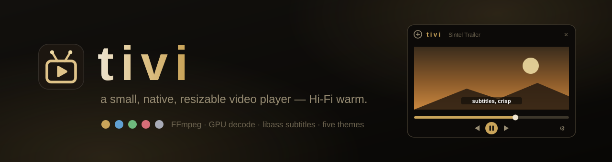
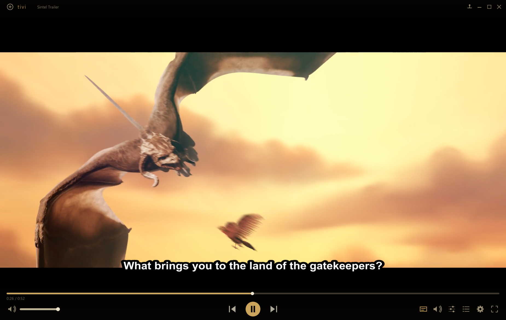
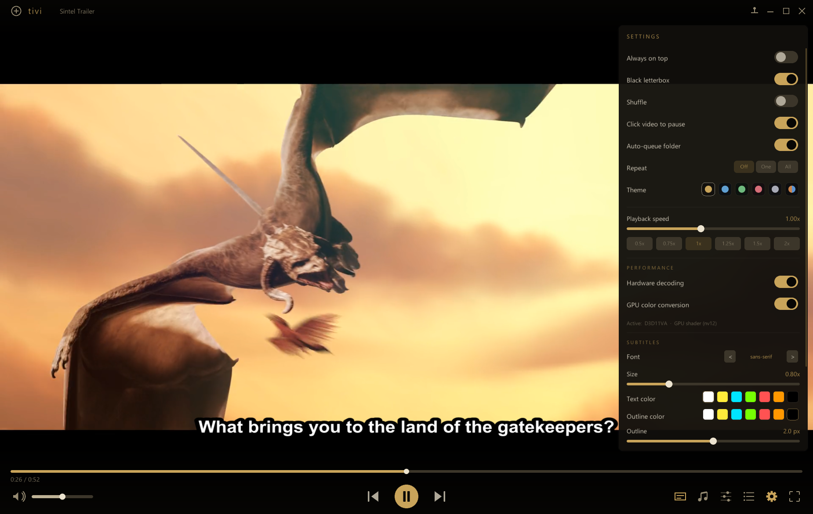

<p align="center">
  
</p>

<p align="center">
  <b>A small, native, <i>resizable</i> video player written in C — VLC-class playback in a warm Hi-Fi shell.</b>
</p>

<p align="center">
  <a href="https://github.com/fezcode/tivi/releases/latest"></a>
  <a href="https://github.com/fezcode/tivi/releases"></a>
  
  
  
  
  
  
</p>

---

Built on [raylib](https://www.raylib.com/) for the window and GPU, [FFmpeg](https://ffmpeg.org/)
for demux/decode, and [libass](https://github.com/libass/libass) for subtitles — styled after
[Timp](../Timp). Every codec FFmpeg supports, hardware-accelerated decode, crisp styled
subtitles, video adjustments, and track switching, wrapped in a borderless, fluid interface.

<p align="center">
  
</p>

## ✨ Features

- 🎬 **Plays everything** — demux + decode through FFmpeg's `libav*`: H.264 / HEVC / AV1 / VP9 /
  MPEG-2/4, VC-1, ProRes, Theora, … with AAC / AC-3 / E-AC-3 / DTS / Opus / Vorbis / MP3 / FLAC / TrueHD audio.
- ⚡ **GPU-accelerated** — D3D11VA hardware decode with automatic software fallback, plus
  shader-side YUV→RGB color conversion (8-bit NV12 and 10-bit P010). Smooth 1080p x265 10-bit
  on modest CPUs; toggles and a live decode-path readout in Settings.
- 💬 **Subtitles, done right** — embedded **and** external `.srt` / `.ass` / `.ssa` / `.vtt` / `.sub`,
  image subs (PGS / VOBSUB / DVB), full ASS/SSA styling. Rasterized at **display resolution** for
  VLC-crisp anti-aliasing, with font / size / color / outline / shadow options for plain-text subs —
  authored ASS styling is respected.
- 🎯 **Precise seeking** — arrow-key seeks land exactly on target even on WEB-DLs with 10–20 s
  keyframe gaps (keyframe seek + preroll decode).
- 📺 **Auto-queue** — open one episode and the rest of the folder queues behind it automatically,
  in natural order (`E2` before `E10`); toggleable in Settings.
- 🎨 **Video adjustments & themes** — brightness, contrast, saturation, hue, gamma live on the GPU;
  five color themes (Gold, Ocean, Forest, Rose, Slate) plus an **Adaptive** theme that tints the
  UI from the colors of what's playing.
- 🔊 **Volume boost** — VLC-style software amplification up to **200%** for quiet media, with a
  100% notch on the slider.
- 🪟 **Native feel** — borderless resizable window (drag any edge), aero snap, Win11 rounded
  corners + shadow, fullscreen, always-on-top, letterboxed fluid layout, pinnable control bar.
- 🎚️ **Transport** — play/pause, drag-to-seek, ±5 s / ±10 s, volume, mute, playback speed
  (0.25–2×) with **pitch-preserving time-stretch** (VLC-style, toggleable), 3-state repeat,
  shuffle, playlist with drag-and-drop enqueue.
- 🔊 **Proper A/V sync** — audio-master clock, background decode thread, late-frame scheduling.
- 🖥️ **System integration** — system-wide media keys, single-instance (second launch hands its
  files over), snapshot to PNG (`S`), persistent settings.

<p align="center">
  
</p>

## 📦 Install

Grab **`tivi-Setup-<version>.exe`** from the [latest release](https://github.com/fezcode/tivi/releases/latest)
and run it — fully self-contained (FFmpeg, libass and raylib bundled), registers in
Add/Remove Programs, ships its own uninstaller. Silent install: `Setup.exe /S`.

Settings live in `%APPDATA%\tivi` and survive uninstall.

## 🚀 Usage

- **Open**: drag files/folders onto the window, click **`+`** (top-left), or press `O`.
- **Subtitle files**: drag a `.srt`/`.ass`/… onto the window, or CC panel › *Load subtitle file…*
- **Resize**: drag any window edge or corner. **Move**: drag the top bar.
- **Click the video** to play/pause; **double-click** for fullscreen; **right-click** for the
  context menu (play/pause, open, snapshot, fullscreen, always-on-top, panels, exit).

### ⌨️ Keyboard

| Key | Action | Key | Action |
| --- | --- | --- | --- |
| Space | Play / pause | `F` / dbl-click | Fullscreen |
| ← / → | Seek −5 s / +5 s | `J` / `L` | Seek −10 s / +10 s |
| ↑ / ↓ | Volume up / down | `M` | Mute |
| `N` / `B` | Next / previous | `S` | Snapshot (PNG) |
| `C` | Cycle subtitle track | `X` | Cycle audio track |
| `[` / `]` or `-` / `+` | Slower / faster | `\` | Reset speed |
| `Q` | Playlist panel | `A` | Adjustments panel |
| `G` | Settings panel | `T` | Always on top |
| `R` | Cycle repeat | Esc | Back / exit fullscreen |
| Media keys | Play/Pause, Stop, Prev, Next (system-wide) | | |

## 🔨 Building

### Dependencies (MSYS2 / MinGW-w64)

```powershell
pacman -S mingw-w64-x86_64-gcc mingw-w64-x86_64-pkgconf `
          mingw-w64-x86_64-raylib mingw-w64-x86_64-ffmpeg mingw-w64-x86_64-libass
```

### Build

```powershell
.\build.ps1
.\build\tivi.exe "C:\path\to\movie.mkv"
```

| Script | Does |
| --- | --- |
| `build.ps1`     | Compiles + links `build\tivi.exe`. |
| `bundle.ps1`    | Stages a standalone `dist\win-x64\` (exe + full DLL closure — copy anywhere). |
| `installer.ps1` | Packages `dist\win-x64\` into a Windows `Setup.exe` via [Forge](../Forge). |

## ⚙️ Configuration

`config.ini` lives in `%APPDATA%\tivi\`. Settings **autosave as you change them** — a crash or
kill can't lose them. Persisted: volume, always-on-top, theme, subtitle settings (font, size,
colors, outline, shadow), hardware decode / GPU conversion toggles, auto-queue, pinned controls,
the five video adjustments, and window geometry. Snapshots (`S`) are saved to the **Desktop**.

## 💻 Command line

```
tivi [files...]      Open and play (multiple files queue up)
tivi -h | --help     Show help
tivi -v | --version  Show version
tivi --probe FILE    Decode self-test: print stream info (diagnostic)
```

## 🗂️ Project layout

```
src/
  main.c        window, resizable borderless chrome, UI, panels, input, drawing
  player.c      FFmpeg engine — demux/decode thread, D3D11VA, A/V sync, precise seek
  yuvtex.c      raw-GL Y/UV plane textures for shader color conversion (NV12/P010)
  audio_out.c   raylib AudioStream + lock-free PCM ring (audio clock = master)
  subs.c        libass subtitle rendering (embedded + external, ASS/SRT/VTT, style overrides)
  playlist.c    queue / index management
  osvideo.c     native open dialogs, DWM corners/shadow, UTF-8 args, console
  viconfig.c    persistent %APPDATA% settings
  mediakeys.c   system-wide media-key hotkeys
  singleinst.c  single-instance (forward files to the running window)
assets/tivi.ico embedded Windows executable icon
```

## 🙏 Credits

- **[raylib](https://www.raylib.com/)** — window, input, GPU rendering, audio output (zlib)
- **[FFmpeg](https://ffmpeg.org/)** (`libav*`) — demux / decode / resample / scale (LGPL/GPL)
- **[libass](https://github.com/libass/libass)** — ASS/SSA/SRT subtitle rendering (ISC)
- Visual design after **Timp** by Şamil Bülbül.
- Screenshots show the [Sintel](https://durian.blender.org/) trailer — © Blender Foundation,
  [durian.blender.org](https://durian.blender.org/), CC-BY 3.0.

All code written for this project is released into the public domain.
