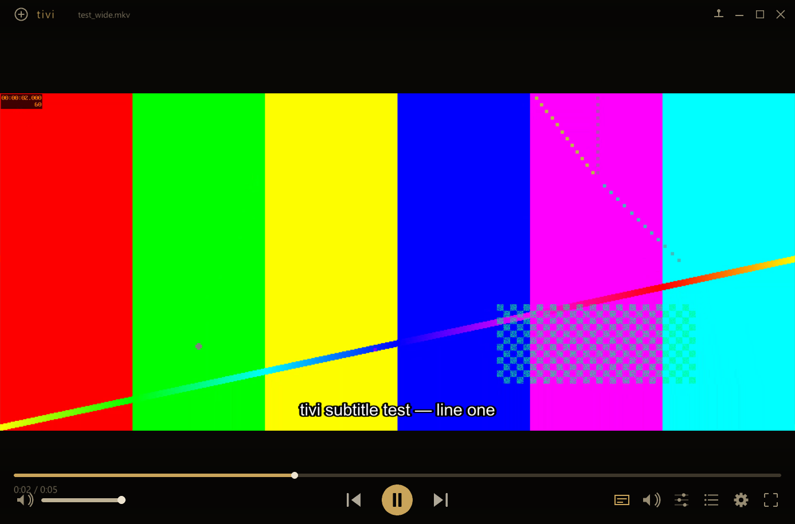

# tivi

A small, native, **resizable** video player written in C with
[raylib](https://www.raylib.com/) — styled after [Timp](../Timp), powered by
[FFmpeg](https://ffmpeg.org/) for decode and [libass](https://github.com/libass/libass)
for subtitles. VLC-class playback (every codec FFmpeg supports, subtitles, video
adjustments, track switching) wrapped in a borderless, warm Hi‑Fi interface.

<p align="center">
  
</p>

## Features

- **Plays everything** — demux + decode go through FFmpeg's `libav*`, so any
  container/codec your FFmpeg build supports works: H.264/HEVC/AV1/VP9/MPEG‑2/4,
  VC‑1, ProRes, Theora, … with AAC/AC‑3/E‑AC‑3/DTS/Opus/Vorbis/MP3/FLAC/TrueHD…
- **Resizable, borderless window** — drag any edge/corner to resize, drag the top
  bar to move, double‑click or `F` for fullscreen, maximize button, always‑on‑top.
  Win11 DWM rounded corners + drop shadow; the picture is letterboxed and the
  layout is fully fluid.
- **Subtitles (libass)** — embedded **and** external `.srt` / `.ass` / `.ssa` /
  `.vtt` / `.sub`, with full ASS/SSA styling; image subs (PGS / VOBSUB / DVB) are
  composited too. Subtitles lift above the controls while they're showing.
- **Video adjustments** — brightness, contrast, saturation, hue, and gamma, applied
  live on the GPU via a fragment shader (VLC's "Video Effects" essentials).
- **Track switching** — pick any audio or subtitle track from the side panels, or
  cycle with `X` / `C`. Load an external subtitle file from the **CC** panel.
- **Transport** — play/pause, drag‑to‑seek, ±5 s / ±10 s, volume, mute, prev/next,
  playback speed (`[` `]` `\`), and a 3‑state repeat (off / one / all) + shuffle.
- **Playlist** — drag files or folders in to enqueue; reorder by playing; auto‑advance.
- **Snapshot** — `S` saves the current frame to a PNG.
- **A/V sync** — audio is the master clock; video frames are scheduled against it,
  with late‑frame dropping, on a background decode thread.
- **System integration** — system‑wide media keys, single‑instance (a second launch
  hands its files to the running window), and persistent settings.

## Building

### Dependencies (MSYS2 / MinGW‑w64)

```powershell
pacman -S mingw-w64-x86_64-gcc mingw-w64-x86_64-pkgconf `
          mingw-w64-x86_64-raylib mingw-w64-x86_64-ffmpeg mingw-w64-x86_64-libass
```

### Build

```powershell
.\build.ps1
.\build\tivi.exe "C:\path\to\movie.mkv"
```

`build.ps1` compiles `src/*.c`, embeds the `.exe` icon (windres), and links
`build\tivi.exe`. raylib is statically linked; FFmpeg/libass are linked against the
mingw64 DLLs, so those DLLs must be reachable at run time (they are inside the
mingw64 shell).

### Standalone build

```powershell
.\bundle.ps1        # → dist\win-x64\  (tivi.exe + every DLL it needs)
```

`bundle.ps1` walks the DLL dependency closure and stages a fully self‑contained
folder you can copy to any Windows machine.

| Script | Does |
| --- | --- |
| `build.ps1`     | Compiles + links `build\tivi.exe`. |
| `bundle.ps1`    | Stages a standalone `dist\win-x64\` (exe + DLLs). |
| `installer.ps1` | Packages `dist\win-x64\` into a Windows `Setup.exe` via [Forge](../Forge). Optional. |

## Usage

- **Open**: drag files/folders onto the window, click **`+`** (top‑left), or press `O`.
- **Subtitle files**: drag a `.srt`/`.ass`/… onto the window, or use the **CC** panel ›
  *Load subtitle file…*
- **Resize**: drag any window edge or corner. **Move**: drag the top bar.
- **Click the video** to play/pause; **double‑click** for fullscreen.

### Keyboard

| Key | Action | Key | Action |
| --- | --- | --- | --- |
| Space | Play / pause | `F` / dbl‑click | Fullscreen |
| ← / → | Seek −5 s / +5 s | `J` / `L` | Seek −10 s / +10 s |
| ↑ / ↓ | Volume up / down | `M` | Mute |
| `N` / `B` | Next / previous | `S` | Snapshot (PNG) |
| `C` | Cycle subtitle track | `X` | Cycle audio track |
| `[` / `]` | Slower / faster | `\` | Reset speed |
| `Q` | Playlist panel | `A` | Adjustments panel |
| `G` | Settings panel | `T` | Always on top |
| `R` | Cycle repeat | Esc | Back / exit fullscreen |
| Media keys | Play/Pause, Stop, Prev, Next (system‑wide) | | |

## Configuration

`config.ini` lives in `%APPDATA%\tivi\`. Persisted: volume, always‑on‑top,
subtitles on/off, the five video adjustments, and the window geometry.

## Command line

```
tivi [files...]      Open and play (multiple files queue up)
tivi -h | --help     Show help
tivi -v | --version  Show version
tivi --probe FILE    Decode self‑test: print stream info (diagnostic)
```

## Project layout

```
src/
  main.c        window, resizable borderless chrome, UI, panels, input, drawing
  player.c      FFmpeg engine — demux/decode thread, A/V sync, seek, tracks
  audio_out.c   raylib AudioStream + lock-free PCM ring (audio clock = master)
  subs.c        libass subtitle rendering (embedded + external, ASS/SRT/VTT)
  playlist.c    queue / index management
  osvideo.c     native open dialogs, DWM corners/shadow, UTF-8 args, console
  viconfig.c    persistent %APPDATA% settings
  mediakeys.c   system-wide media-key hotkeys
  singleinst.c  single-instance (forward files to the running window)
assets/tivi.ico embedded Windows executable icon
```

## Credits

- **raylib** — window, input, GPU rendering, audio output (zlib)
- **FFmpeg** (`libav*`) — demux / decode / resample / scale (LGPL/GPL)
- **libass** — ASS/SSA/SRT subtitle rendering (ISC)
- Visual design after **Timp** by Şamil Bülbül.

All code written for this project is released into the public domain.
